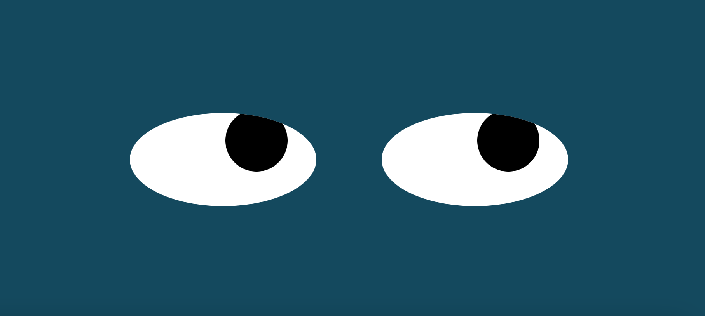

# Eye-Excercise
A project designed to show the power of the DOM, an Eye will follow the movement of the mouse

<h2> Description </h2>
  

 This project uses thhe DOM as a way to access to HTML through the use of javascript and manipulate the elements in order to give it an interacction wit the user interface. The elements are created on HTML then they are styled using CSS and finally the behaviour of the eye in direct relation with the mouse movement is made with Javascript

<h2> Instalation </h2>

<ul>
  <li> The code is free to download from this repository</li>
  <li> All the files have been linked to the index file for proper functioning</li>
  <li> If you are using VS Code I would recomend you download the LiveServer extention in order to watch the changes from the code live</li>
  <li> Is better to follow the behaviour of each component of the code by using Google Chrome Browser on the Inspection tools</li>
</ul>

<h2> Usage </h2>

 The usage is directly related to the DOM which is a very important concept in order to understand the behavioral applications of Javascript in a site. The purpose of the excersise is related to animation but the applications of the DOM involve many proposals to make a website more dynamic.

<h2> Support </h2>

If you are stuck somewhere in this code, please feel free to contact me at:

<h4>Email:</h4>

<a href="mailto:jplarraga@gmail.com">jplarraga@gmail.com</a>

<h4>Twitter:</h4>

@jplarraga

 

<h2>Roadmap</h2>

 The project is limited to the relation of the mouse movement, however there is plenty of room to create more applications for the DOM related to the scroll, the navigation, the appearance and even the execution of a certain task only by using the DOM. Furthermore, we can also implement various other elemenst such as buttons, lists, accordions, sliders, etc.

  
<h2>License Information</h2>

Copyright (c) 2021 Juan Larraga

Permission is hereby granted, free of charge, to any person obtaining a copy of this software and associated documentation files (the "Software"), to deal in the Software without restriction, including without limitation the rights to use, copy, modify, merge, publish, distribute, sublicense, and/or sell copies of the Software, and to permit persons to whom the Software is furnished to do so, subject to the following conditions:

The above copyright notice and this permission notice shall be included in all copies or substantial portions of the Software.

THE SOFTWARE IS PROVIDED "AS IS", WITHOUT WARRANTY OF ANY KIND, EXPRESS OR IMPLIED, INCLUDING BUT NOT LIMITED TO THE WARRANTIES OF MERCHANTABILITY, FITNESS FOR A PARTICULAR PURPOSE AND NONINFRINGEMENT. IN NO EVENT SHALL THE AUTHORS OR COPYRIGHT HOLDERS BE LIABLE FOR ANY CLAIM, DAMAGES OR OTHER LIABILITY, WHETHER IN AN ACTION OF CONTRACT, TORT OR OTHERWISE, ARISING FROM, OUT OF OR IN CONNECTION WITH THE SOFTWARE OR THE USE OR OTHER DEALINGS IN THE SOFTWARE. 

 
  

